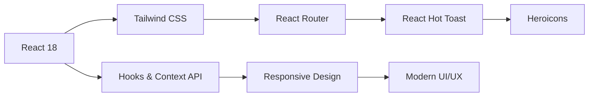
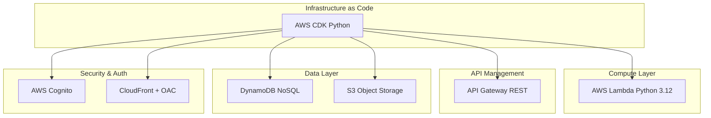
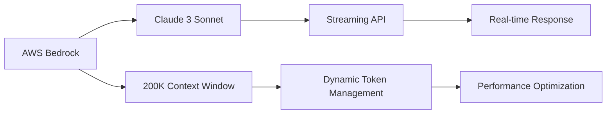
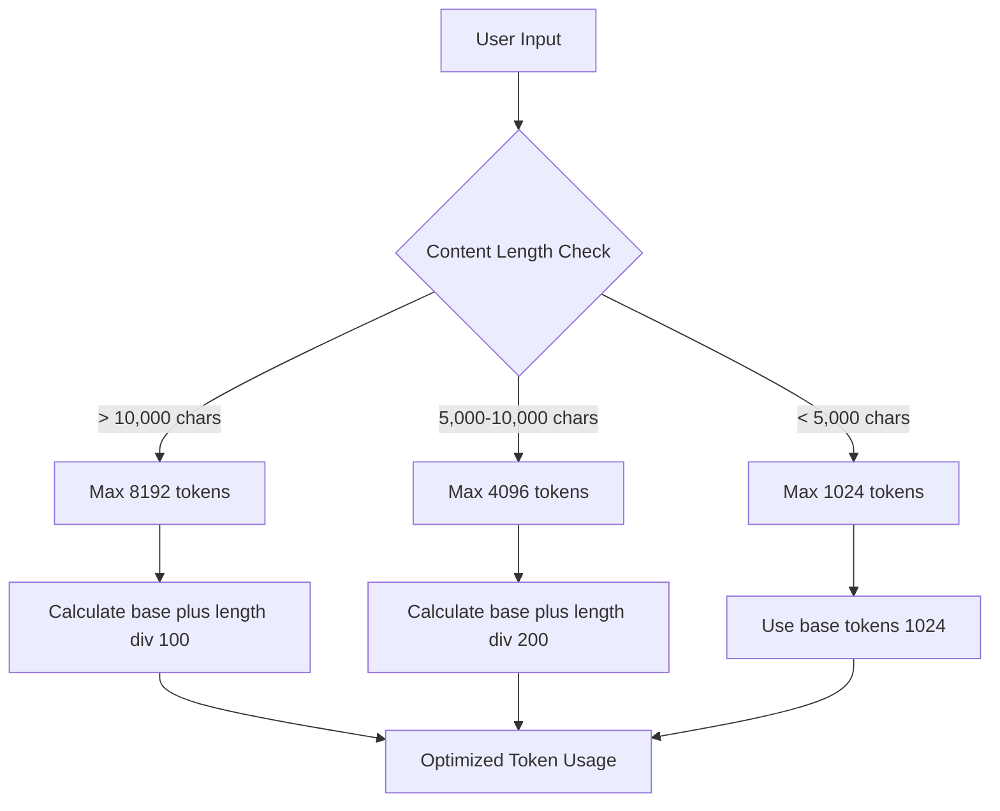
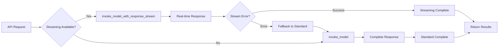
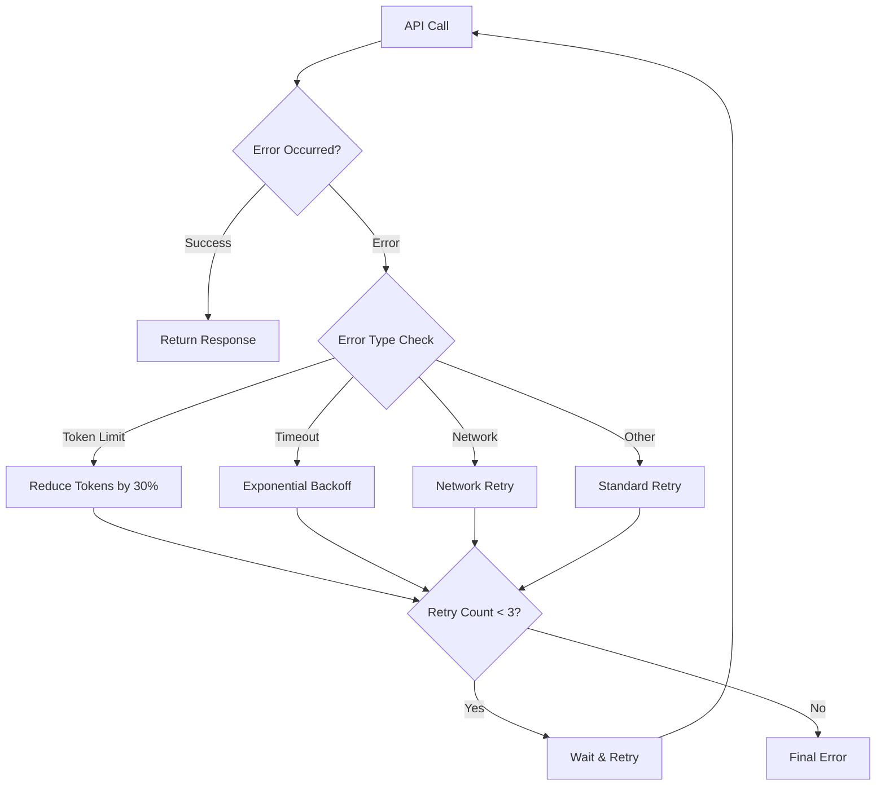

# AI Title Generation System

A scalable, serverless AI-powered title generation system built on AWS infrastructure using AWS Bedrock Claude 3 Sonnet model. This system provides intelligent title suggestions for various content types with real-time streaming capabilities and advanced performance optimizations.

## Table of Contents

- [Service Overview](#ai-title-generation-system)
- [Architecture Overview](#architecture-overview)
- [Key Design Decisions](#key-design-decisions)
- [Implementation Timeline](#implementation-timeline)
- [References](#references--resources)

## Architecture Overview

> **이 섹션에서는 시스템의 전체 구조와 주요 워크플로우를 시각적으로 설명합니다.**

---

### System Architecture Overview

**전체 AWS 서비스 구조와 컴포넌트 간의 관계를 보여주는 고수준 아키텍처 다이어그램**


---

### User Workflow Diagrams

#### 1. Prompt Template Creation & Management Process

**사용자가 프롬프트 템플릿을 생성하고 저장하는 전체 플로우**


#### 2. AI Title Generation Process

**프롬프트 템플릿을 사용한 실시간 제목 생성 워크플로우**


---

### Database Schema & Data Relationships

**DynamoDB 테이블 구조와 S3 객체 간의 관계를 나타내는 ER 다이어그램**

```mermaid
erDiagram
    USERS {
        string userId PK
        string email
        string name
        string createdAt
    }

    PROJECTS {
        string userId PK
        string projectId SK
        string name
        string description
        string createdAt
    }

    PROMPTS {
        string promptId PK
        string userId
        string title
        string template
        string createdAt
    }

    CONVERSATIONS {
        string projectId PK
        string timestamp SK
        string userId
        string userInput
        string aiResponse
        string promptId
    }

    USERS ||--o{ PROJECTS : creates
    PROJECTS ||--o{ CONVERSATIONS : contains
    USERS ||--o{ PROMPTS : owns
```

---

## Core Features

### Key Capabilities

| Feature                         | Description                                                   | Technology          |
| ------------------------------- | ------------------------------------------------------------- | ------------------- |
| **AI-Powered Title Generation** | Claude 3 Sonnet을 활용한 지능형 콘텐츠 분석 및 제목 생성      | AWS Bedrock         |
| **Real-time Streaming**         | 향상된 사용자 경험을 위한 스트리밍 응답 구현                  | Server-Sent Events  |
| **Dynamic Prompt Management**   | 템플릿 변수와 버전 관리가 포함된 커스터마이징 가능한 프롬프트 | DynamoDB + S3       |
| **Performance Optimization**    | 고급 타임아웃 처리, 재시도 로직, 토큰 관리                    | Lambda + CloudWatch |
| **Scalable Infrastructure**     | 자동 스케일링 기능을 갖춘 서버리스 아키텍처                   | AWS Serverless      |
| **User Authentication**         | AWS Cognito 통합을 통한 보안 액세스                           | Cognito + IAM       |
| **Project Management**          | 여러 제목 생성 프로젝트 관리를 위한 체계적인 작업공간         | DynamoDB            |

---

## Technology Stack

### Frontend Technologies



**주요 구성 요소:**

- **React 18** - Hooks와 Context API를 활용한 현대적 프론트엔드
- **Tailwind CSS** - 반응형 UI 디자인 프레임워크
- **React Router** - 클라이언트 사이드 네비게이션
- **React Hot Toast** - 사용자 알림 시스템
- **Heroicons** - 일관된 아이콘 시스템

### Backend Infrastructure



**핵심 AWS 서비스:**

- **AWS CDK (Python)** - Infrastructure as Code
- **AWS Lambda (Python 3.12)** - 서버리스 컴퓨팅
- **AWS API Gateway** - REST API 관리
- **AWS DynamoDB** - NoSQL 데이터베이스
- **AWS Cognito** - 인증 및 사용자 관리
- **AWS S3** - 정적 자산 호스팅
- **AWS CloudFront** - OAC를 통한 글로벌 콘텐츠 전송

### AI/ML Stack



**AI 기술 스택:**

- **AWS Bedrock** - 파운데이션 모델 액세스 플랫폼
- **Claude 3 Sonnet** - 주요 언어 모델 (200K 컨텍스트)
- **Streaming API** - 실시간 응답 생성
- **Dynamic Optimization** - 지능형 토큰 관리 및 성능 최적화

---

## AWS Bedrock Configuration

### Model Selection & Specifications

| Setting               | Value                                     | Description                                  |
| --------------------- | ----------------------------------------- | -------------------------------------------- |
| **Primary Model**     | `anthropic.claude-3-sonnet-20240229-v1:0` | Latest Claude 3 Sonnet model                 |
| **Context Window**    | 200,000 tokens                            | Large context processing available           |
| **Max Output Tokens** | 1024-8192 (dynamic adjustment)            | Automatic optimization based on input length |
| **Temperature**       | 0.7                                       | Balance between creativity and consistency   |
| **Stream Support**    | ✅ Enabled                                | Real-time response streaming                 |

---

### Performance Optimizations

#### 1. Dynamic Token Management

**Intelligent token allocation based on input length**



```python
def calculate_dynamic_max_tokens(input_length):
    """입력 길이에 따른 동적 토큰 계산"""
    base_tokens = 1024

    if input_length > 10000:
        return min(8192, base_tokens + (input_length // 100))
    elif input_length > 5000:
        return min(4096, base_tokens + (input_length // 200))

    return base_tokens
```

#### 2. Streaming Implementation Strategy



**Key Implementation Features:**

- **Primary**: `invoke_model_with_response_stream` - Real-time response
- **Fallback**: `invoke_model` - Compatibility guarantee
- **Error Handling**: Automatic fallback on streaming failure

#### 3. Advanced Retry Logic



**Retry Strategy:**

- **Max Retries**: 3 attempts (exponential backoff)
- **Token Reduction**: Reduce tokens by 30% on token limit errors
- **Intelligent Retry**: Different strategies for different error types

---

### Prompt Engineering

#### Template Structure

**Structured prompt templates for high-quality title generation**

```python
TITLE_GENERATION_PROMPT = """
Role: You are a professional title generation expert.

Context: {context}
Requirements: {requirements}
Style: {style}

Content: {content}

Generate titles that meet the following conditions:
1. Core message must be clearly conveyed
2. It must be able to capture reader interest
3. Consider SEO optimization
4. It must be easily readable on mobile screens
5. {additional_instructions}

Generate {count} diverse titles.
"""
```

#### Template Variables System

| Variable                    | Description                  | Example                                     |
| --------------------------- | ---------------------------- | ------------------------------------------- |
| `{context}`                 | Content background info      | "News article", "Blog post"                 |
| `{requirements}`            | Special requirements         | "30 characters or less", "Keyword included" |
| `{style}`                   | Title style                  | "Formal", "Friendly", "Emotional"           |
| `{content}`                 | Actual content               | User input text                             |
| `{additional_instructions}` | Additional instructions      | Client-specific special requests            |
| `{count}`                   | Number of titles to generate | 3, 5, 10 etc.                               |

---

## AWS Infrastructure Details

### Serverless Architecture Overview

This system is built on a **100% serverless architecture** with no traditional servers to manage, providing automatic scaling, high availability, and cost optimization.

### Compute Infrastructure

#### 1. AWS Lambda Functions

**Generate Function (Core AI Processing)**

- **Runtime**: Python 3.12
- **Memory**: 3008 MB (maximum allocation)
- **Timeout**: 900 seconds (15 minutes)
- **Reserved Concurrency**: 10 concurrent executions
- **Environment Variables**:
  - `BEDROCK_MODEL_ID`: Model identifier
  - `MAX_TOKENS`: Token limits
  - `REGION`: AWS region
- **VPC**: Not configured (uses AWS managed networking)
- **Layers**: Custom layer for shared dependencies

**Project Management Functions**

- **Runtime**: Python 3.12
- **Memory**: 512 MB
- **Timeout**: 30 seconds
- **Purpose**: CRUD operations for project lifecycle management
- **Concurrent Executions**: 20 (auto-scaling)

**Authentication Functions**

- **Runtime**: Python 3.12
- **Memory**: 256 MB
- **Timeout**: 10 seconds
- **Purpose**: User authentication, token validation, session management
- **Integration**: Direct integration with Cognito User Pool

#### 2. AWS API Gateway

**REST API Configuration**

- **Type**: Regional REST API
- **Authorization**: Cognito User Pool Authorizer
- **Throttling**: 1000 requests/minute per user
- **Request Validation**: JSON schema validation enabled
- **CORS Configuration**:
  ```json
  {
    "allowOrigins": ["https://your-domain.com"],
    "allowMethods": ["GET", "POST", "PUT", "DELETE", "OPTIONS"],
    "allowHeaders": ["Content-Type", "Authorization"],
    "maxAge": 86400
  }
  ```

### Storage Infrastructure

#### 1. Amazon DynamoDB Tables

**Projects Table**

```python
{
    "TableName": "bedrock-diy-projects",
    "BillingMode": "PAY_PER_REQUEST",
    "KeySchema": [
        {"AttributeName": "user_id", "KeyType": "HASH"},
        {"AttributeName": "project_id", "KeyType": "RANGE"}
    ],
    "AttributeDefinitions": [
        {"AttributeName": "user_id", "AttributeType": "S"},
        {"AttributeName": "project_id", "AttributeType": "S"}
    ],
    "StreamSpecification": {
        "StreamViewType": "NEW_AND_OLD_IMAGES"
    },
    "PointInTimeRecoverySpecification": {"Enabled": True},
    "DeletionProtectionEnabled": True
}
```

**Chat History Table**

```python
{
    "TableName": "bedrock-diy-conversations",
    "BillingMode": "PAY_PER_REQUEST",
    "KeySchema": [
        {"AttributeName": "project_id", "KeyType": "HASH"},
        {"AttributeName": "timestamp", "KeyType": "RANGE"}
    ],
    "TimeToLiveSpecification": {
        "Enabled": True,
        "AttributeName": "ttl"  # 30 days retention
    },
    "GlobalSecondaryIndexes": [
        {
            "IndexName": "user-timestamp-index",
            "KeySchema": [
                {"AttributeName": "user_id", "KeyType": "HASH"},
                {"AttributeName": "timestamp", "KeyType": "RANGE"}
            ]
        }
    ]
}
```

#### 2. Amazon S3 Storage

**Frontend Assets Bucket**

- **Bucket Policy**: Private with CloudFront OAC access only
- **Encryption**: AES-256 server-side encryption
- **Versioning**: Disabled (CDK manages deployments)
- **Lifecycle Rules**:
  - Abort incomplete multipart uploads after 7 days
  - Delete old versions after 30 days

### Content Delivery Network (CDN)

#### CloudFront Distribution

**Distribution Configuration**

```python
{
    "PriceClass": "PriceClass_100",  # US, Canada, Europe
    "DefaultRootObject": "index.html",
    "ViewerProtocolPolicy": "redirect-to-https",
    "MinimumProtocolVersion": "TLSv1.2_2021",
    "Compression": True
}
```

**Caching Behaviors**

- **Static Assets** (_.js, _.css, \*.png, etc.):
  - Cache Policy: `CACHING_OPTIMIZED`
  - TTL: 31536000 seconds (1 year)
  - Compression: Enabled
- **API Calls** (/api/\*):
  - Cache Policy: `CACHING_DISABLED`
  - Origin Request Policy: `ALL_VIEWER`
  - Allowed Methods: `ALLOW_ALL`

**Origin Access Control (OAC)**

- **Signing**: SIGV4_ALWAYS
- **Origin Type**: S3
- **Enhanced Security**: Short-term credentials with frequent rotation

### AI/ML Infrastructure

#### AWS Bedrock Integration

**Model Access**

- **Foundation Model**: Claude 3 Sonnet
- **Model ARN**: `arn:aws:bedrock:us-east-1::foundation-model/anthropic.claude-3-sonnet-20240229-v1:0`
- **Cross-Region Inference**: Disabled (single region deployment)
- **Model Invocation Logging**: Enabled for monitoring

**Inference Configuration**

```python
{
    "modelId": "anthropic.claude-3-sonnet-20240229-v1:0",
    "contentType": "application/json",
    "accept": "application/json",
    "body": {
        "anthropic_version": "bedrock-2023-05-31",
        "max_tokens": "dynamic (1024-8192)",
        "temperature": 0.7,
        "system": "You are a professional title generation expert...",
        "messages": [...]
    }
}
```

### Networking and Security

#### VPC Configuration

- **VPC**: Not used (Lambda functions use AWS managed VPC)
- **Reason**: No private resources requiring VPC isolation
- **Cost Optimization**: Eliminates NAT Gateway costs

#### Security Groups and NACLs

- **Not Applicable**: Serverless architecture uses AWS managed networking
- **Security**: Implemented through IAM policies and resource-based policies

#### DNS and Domain Management

- **Route 53**: Not configured in this stack
- **CloudFront Domain**: Uses default CloudFront domain (.cloudfront.net)
- **Custom Domain**: Can be added via Route 53 + ACM certificate

### Authentication and Authorization

#### AWS Cognito User Pool

**User Pool Configuration**

```python
{
    "UserPoolName": "bedrock-diy-users",
    "UsernameAttributes": ["email"],
    "AutoVerifiedAttributes": ["email"],
    "PasswordPolicy": {
        "MinimumLength": 8,
        "RequireUppercase": True,
        "RequireLowercase": True,
        "RequireNumbers": True,
        "RequireSymbols": True
    },
    "MfaConfiguration": "OPTIONAL",
    "AccountRecoverySetting": {
        "RecoveryMechanisms": [
            {"Name": "verified_email", "Priority": 1}
        ]
    }
}
```

#### IAM Roles and Policies

**Lambda Execution Role**

```json
{
  "Version": "2012-10-17",
  "Statement": [
    {
      "Effect": "Allow",
      "Action": [
        "bedrock:InvokeModel",
        "bedrock:InvokeModelWithResponseStream"
      ],
      "Resource": "arn:aws:bedrock:*::foundation-model/anthropic.claude-3-sonnet-*"
    },
    {
      "Effect": "Allow",
      "Action": [
        "dynamodb:GetItem",
        "dynamodb:PutItem",
        "dynamodb:UpdateItem",
        "dynamodb:DeleteItem",
        "dynamodb:Query",
        "dynamodb:Scan"
      ],
      "Resource": ["arn:aws:dynamodb:*:*:table/bedrock-diy-*"]
    }
  ]
}
```

### Monitoring and Logging Infrastructure

#### CloudWatch Configuration

- **Log Groups**: Separate log groups for each Lambda function
- **Log Retention**: 14 days for cost optimization
- **Custom Metrics**: Business metrics for title generation performance
- **Alarms**:
  - Lambda error rates > 5%
  - Lambda duration > 30 seconds
  - DynamoDB throttling events

#### AWS X-Ray Tracing

- **Enabled**: For all Lambda functions
- **Sampling Rate**: 10% for cost optimization
- **Service Map**: Provides visual representation of request flow

### Disaster Recovery and Backup

#### Data Backup Strategy

- **DynamoDB**: Point-in-time recovery enabled
- **S3**: Versioning disabled (CDK manages state)
- **Cross-Region**: Single region deployment (can be extended)

#### High Availability

- **Multi-AZ**: Automatic (DynamoDB, Lambda, API Gateway)
- **Global Edge Locations**: CloudFront provides global availability
- **Auto-Scaling**: Built into all serverless components

### Cost Optimization Features

#### Resource Optimization

- **Lambda**: Right-sized memory allocation
- **DynamoDB**: On-demand billing
- **CloudFront**: Price class 100 (cost-optimized regions)
- **S3**: Lifecycle policies for cost management

#### Estimated Monthly Costs (Production Usage)

```
- Lambda (1M requests): ~$15-25
- DynamoDB (10GB, 1M R/W): ~$5-10
- Bedrock (100K tokens/day): ~$20-40
- CloudFront (100GB transfer): ~$8-12
- S3 Storage (10GB): ~$0.23
- API Gateway (1M requests): ~$3.50
- Total Estimated: ~$50-90/month
```

## Model Tuning and Optimization

### Token Management Strategy

1. **Input Analysis**: Dynamic token calculation based on content length
2. **Context Optimization**: Automatic chat history trimming (20+ messages)
3. **Output Control**: Adaptive max_tokens based on request complexity

### Error Handling and Resilience

```python
# Retry configuration
RETRY_CONFIG = {
    "max_attempts": 3,
    "backoff_multiplier": 2,
    "token_reduction_factor": 0.7,
    "supported_errors": [
        "ValidationException",
        "ThrottlingException",
        "ServiceUnavailableException"
    ]
}
```

### Performance Monitoring

- **CloudWatch Metrics**: Custom metrics for response times, error rates
- **Structured Logging**: Detailed performance logs for each request phase
- **Timeout Tracking**: Progressive timeout handling (Frontend: 900s, Lambda: 900s)

## Deployment Guide

### Prerequisites

- AWS CLI configured with appropriate permissions
- AWS CDK CLI installed (`npm install -g aws-cdk`)
- Python 3.12+
- Node.js 18+

### Deployment Steps

1. **Bootstrap CDK** (first-time only)

```bash
cdk bootstrap
```

2. **Deploy Infrastructure**

```bash
cd cdk
pip install -r requirements.txt
cdk deploy --all --require-approval never
```

3. **Build and Deploy Frontend**

```bash
cd frontend
npm install
npm run build
# Files automatically uploaded to S3 via CDK deployment
```

### Environment Configuration

```bash
# Required environment variables
AWS_REGION=us-east-1
BEDROCK_MODEL_ID=anthropic.claude-3-sonnet-20240229-v1:0
MAX_TOKENS=8192
TEMPERATURE=0.7
```

## API Endpoints

### Title Generation

```http
POST /api/generate
Authorization: Bearer {cognito_token}
Content-Type: application/json

{
  "content": "Text content for title generation",
  "context": "Optional context",
  "requirements": "Specific requirements",
  "count": 5
}
```

### Project Management

```http
GET /api/projects
POST /api/projects
PUT /api/projects/{project_id}
DELETE /api/projects/{project_id}
```

## Security Features

- **Authentication**: AWS Cognito User Pool with MFA support
- **Authorization**: Fine-grained IAM policies
- **Data Encryption**: At-rest and in-transit encryption
- **CORS Protection**: Strict CORS policies
- **Rate Limiting**: API Gateway throttling
- **Content Security**: CloudFront security headers

## Performance Characteristics

- **Cold Start**: ~2-3 seconds for Lambda initialization
- **Warm Response**: ~500ms-2s for title generation
- **Throughput**: 1000+ concurrent requests
- **Availability**: 99.9% SLA with multi-AZ deployment
- **Latency**: <100ms CloudFront edge response for static assets

## Monitoring and Observability

- **CloudWatch Logs**: Structured logging for all components
- **CloudWatch Metrics**: Custom business and performance metrics
- **AWS X-Ray**: Distributed tracing for request flow analysis
- **Error Tracking**: Automated error detection and alerting

## References & Resources

This project was developed by studying and referencing the following official documentation, technical resources, and educational materials.

### Official AWS Documentation

#### AWS Bedrock

- **[AWS Bedrock User Guide](https://docs.aws.amazon.com/pdfs/bedrock/latest/userguide/bedrock-ug.pdf)** - Comprehensive guide for AWS Bedrock foundation models
- **[Bedrock Runtime API - Claude Examples](https://docs.aws.amazon.com/pdfs/bedrock/latest/userguide/bedrock-ug.pdf#service_code_examples_bedrock-runtime_anthropic_claude)** - Service code examples for Anthropic Claude integration
- **[Amazon Bedrock Serverless Prompt Chaining](https://github.com/aws-samples/amazon-bedrock-serverless-prompt-chaining)** - AWS samples for serverless prompt orchestration

#### AWS CDK

- **[AWS CDK v2 Guide](https://docs.aws.amazon.com/pdfs/cdk/v2/guide/awscdk.pdf)** - Infrastructure as Code with AWS CDK Python

### AI & Machine Learning Resources

#### Multi-Agent Orchestration

- **[Design Multi-Agent Orchestration with Amazon Bedrock](https://aws.amazon.com/ko/blogs/machine-learning/design-multi-agent-orchestration-with-reasoning-using-amazon-bedrock-and-open-source-frameworks/)** - Advanced AI orchestration patterns and reasoning frameworks

### Educational Materials & Books

#### Technical References

- **[한 권으로 배우는 도커 & 쿠버네티스](https://product.kyobobook.co.kr/detail/S000213057687)** - 컨테이너 개념부터 쿠버네티스를 활용한 배포까지 (장철원 저, 한빛미디어)
- **[클라우드 서비스 개발자를 위한 AWS로 구현하는 CI/CD 배포 입문](https://product.kyobobook.co.kr/detail/S000201078147)** - 신입 개발자부터 실제 서비스 구축 경험이 없는 모든 개발자를 위한 실무 밀착형 입문서 (최주호, 정재원, 정동진 저, 앤써북)
- **[IT 엔지니어를 위한 AWS 운영의 기본과 노하우](https://product.kyobobook.co.kr/detail/S000214036165)** - AWS 클라우드 서비스 운영 및 관리 전문 가이드 (사타케 요이치 외 저, 길벗)
- **[RAG 마스터: 랭체인으로 완성하는 LLM 서비스](https://product.kyobobook.co.kr/detail/S000216240484)** - LangChain을 활용한 RAG 기반 LLM 서비스 구축 실무 (브라이스 유 외 저, 프리렉)
- **[Amazon Bedrock으로 시작하는 실전 생성형 AI 개발](https://product.kyobobook.co.kr/detail/S000214962344)** - AWS Bedrock을 활용한 생성형 AI 애플리케이션 개발 가이드 (임지훈, 최성우 저, 디지털북스)

---

## Project Philosophy

> _"This project demonstrates the power of serverless architecture combined with cutting-edge AI capabilities, creating a scalable and cost-effective solution for intelligent content generation."_

### Key Achievements

- **Zero Server Management** - 100% serverless architecture
- **AI-Powered Intelligence** - Advanced Claude 3 Sonnet integration
- **Enterprise-Ready** - Production-grade security and monitoring
- **Cost-Optimized** - Pay-per-use pricing model
- **Highly Available** - Multi-AZ deployment with automatic failover

---

### Feature Requests

- Feature requests are welcome! Please use GitHub Issues with the `enhancement` label.

### Contributing

1. Fork the repository
2. Create a feature branch (`git checkout -b feature/amazing-feature`)
3. Commit your changes (`git commit -m 'Add amazing feature'`)
4. Push to the branch (`git push origin feature/amazing-feature`)
5. Open a Pull Request

---

## License

This project is licensed under the MIT License - see the [LICENSE](LICENSE) file for details.

---

## Acknowledgments

Special thanks to:

- **AWS Bedrock Team** for providing powerful foundation models
- **Anthropic** for developing Claude 3 Sonnet
- **AWS CDK Team** for excellent Infrastructure as Code tools
- **Open Source Community** for continuous inspiration and support

---

<div align="center">

### Star this repository if you found it helpful!

**Built with ❤️ using AWS Serverless Technologies**

[](https://aws.amazon.com/)
[](https://python.org/)
[](https://reactjs.org/)
[](https://aws.amazon.com/lambda/)

</div>

## Key Design Decisions

| Area           | Choice                        | Rationale                                     |
| -------------- | ----------------------------- | --------------------------------------------- |
| AI Model       | Claude 3 Sonnet               | 200K-token context and superior title quality |
| Infrastructure | 100% AWS Serverless           | Auto-scaling and minimal operational overhead |
| Security       | Cognito + IAM Least-Privilege | Managed auth, granular resource control       |
| Streaming      | Bedrock Response Stream       | Real-time UX with lower end-to-end latency    |

## Implementation Timeline

| Phase                     | Date / Period     | Milestone & Key Outcome                                                                    |
| ------------------------- | ----------------- | ------------------------------------------------------------------------------------------ |
| Discovery                 | 2025-05 ~ 2025-06 | Identified high cloud-cost drivers for large-scale title generation                        |
| User Research             | 2025-06-15        | Conducted user interviews and captured detailed needs                                      |
| Planning                  | 2025-06-20        | Finalised development roadmap and backlog                                                  |
| Cloud Exploration         | 2025-06-23        | Evaluated multiple providers, confirmed AWS Bedrock as core AI platform                    |
| Architecture Design       | 2025-06-26        | Completed high-level and component diagrams                                                |
| AWS Console Deep-Dive     | 2025-07-01        | Studied console workflows, IAM and Bedrock runtime configuration                           |
| CDK & Requirements Review | 2025-07-04        | Set up AWS CDK environment, locked client requirements                                     |
| Database Design           | 2025-07-07        | Finalised DynamoDB schema and S3 storage strategy                                          |
| Model Research            | 2025-07-09        | Bench-tested Claude, Titan, Llama — selected Claude 3 Sonnet                               |
| Vector DB Evaluation      | 2025-07-10        | Reviewed Faiss & alternatives; raw data pipeline chosen (service scale small)              |
| Orchestration POC         | 2025-07-11        | Attempted multi-model orchestration; postponed due to regional & API differences           |
| Backend Data Layer        | 2025-07-12        | Implemented DynamoDB + S3 integration                                                      |
| API + LLM Integration     | 2025-07-13        | Connected prompt card UI to Generate Lambda and Bedrock                                    |
| Chat History Feature      | 2025-07-14        | Implemented custom chat history (LangChain attempt replaced with native DynamoDB approach) |
| Front-end UI/UX           | 2025-07-15        | Designed modern UI inspired by Claude; integrated prompt‐editing side panel                |
| Version 1 Deployment      | 2025-07-16        | Deployed v1 via GitHub Actions & AWS serverless stack (CDK)                                |
