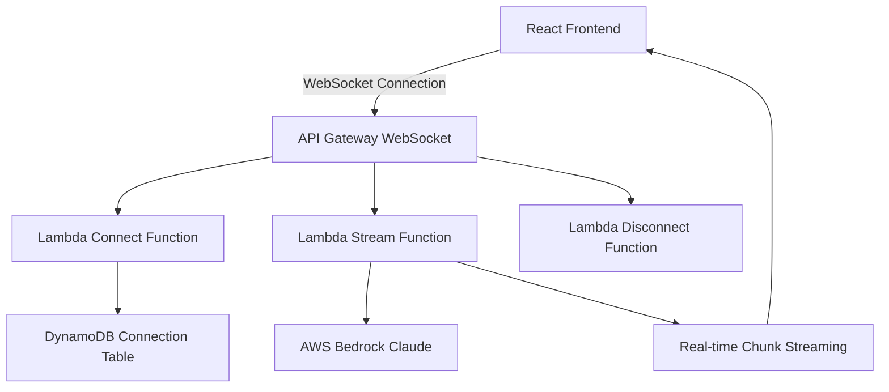

# Real-time Streaming Implementation Guide

## Project Overview

Detailed documentation of implementing real-time text streaming functionality similar to ChatGPT/Claude in an AI title generation system.

**Objective**: Implement streaming functionality where AI responses appear character by character in real-time when users input questions.

## Initial Problem Analysis

### 1. Limitations of Existing System

- **Server-Sent Events (SSE) constraints**: Responses displayed in batches after completion
- **Poor UI responsiveness**: Long waiting periods while users await responses
- **React State management issues**: Streaming message update failures due to `useState` and closure problems

### 2. Core Issues Identified

```javascript
// Problematic code
const [streamingMessageId, setStreamingMessageId] = useState(null);

// Closure issue preventing access to latest state in callback
const handleStreamingResponse = useCallback((chunk) => {
  // streamingMessageId always references initial value (null)
  console.log("Streaming ID:", streamingMessageId); // Always null
}, []);
```

## Problem Resolution Process

### Phase 1: React State Management Issue Resolution

#### Problem Diagnosis

- SSE API functions normally but streaming responses not displayed in UI
- Chrome Developer Tools confirm chunk-based responses but no screen reflection

#### Solution Implementation

```javascript
// Before: useState usage (closure problem)
const [streamingMessageId, setStreamingMessageId] = useState(null);

// After: useRef usage (latest value guarantee)
const streamingMessageIdRef = useRef(null);

// Usage
streamingMessageIdRef.current = newMessageId;
const currentStreamingId = streamingMessageIdRef.current;
```

#### Results

- Streaming message updates function normally
- However, still not true "real-time" streaming but batch processing approach

### Phase 2: WebSocket-based Real-time Streaming Implementation

#### Problem Recognition

Existing SSE approach collected all chunks on server then transmitted in batches.
Recognized that WebSocket is required for true real-time streaming.

#### Architecture Design



#### Implementation Steps

**1. AWS CDK Infrastructure Configuration**

```python
# WebSocket API creation
self.websocket_api = apigatewayv2.WebSocketApi(
    self, "BedrockDiyWebSocketApi",
    api_name="bedrock-diy-websocket-api",
    description="WebSocket API for real-time streaming",
    connect_route_options=apigatewayv2.WebSocketRouteOptions(
        integration=integrations.WebSocketLambdaIntegration(
            "ConnectIntegration",
            self.websocket_connect_lambda
        )
    ),
    disconnect_route_options=apigatewayv2.WebSocketRouteOptions(
        integration=integrations.WebSocketLambdaIntegration(
            "DisconnectIntegration",
            self.websocket_disconnect_lambda
        )
    )
)

# Add Stream route
self.websocket_api.add_route(
    "stream",
    integration=integrations.WebSocketLambdaIntegration(
        "StreamIntegration",
        self.websocket_stream_lambda
    )
)
```

**2. Lambda Functions Implementation**

```python
# connect.py - Connection management
def handler(event, context):
    connection_id = event['requestContext']['connectionId']

    # Store connection info in DynamoDB
    dynamodb.put_item(
        TableName=CONNECTIONS_TABLE,
        Item={
            'connectionId': {'S': connection_id},
            'connectedAt': {'S': datetime.utcnow().isoformat()},
            'ttl': {'N': str(ttl)}
        }
    )

    return {'statusCode': 200}

# stream.py - Real-time streaming
def handler(event, context):
    # Progress stage-by-stage updates
    send_message(connection_id, {
        "type": "progress",
        "step": "Analyzing prompt cards...",
        "progress": 10
    })

    # Real-time chunk transmission
    for chunk in bedrock_stream:
        if chunk.get('contentBlockDelta'):
            text = chunk['contentBlockDelta']['delta']['text']
            send_message(connection_id, {
                "type": "stream_chunk",
                "content": text
            })
```

**3. Frontend WebSocket Client**

```javascript
// useWebSocket.js
export const useWebSocket = (projectId) => {
  const [isConnected, setIsConnected] = useState(false);
  const wsRef = useRef(null);

  const connect = useCallback(() => {
    const wsUrl =
      process.env.REACT_APP_WS_URL ||
      "wss://na17isxiri.execute-api.us-east-1.amazonaws.com/prod";

    wsRef.current = new WebSocket(wsUrl);

    wsRef.current.onopen = () => {
      setIsConnected(true);
      reconnectAttempts.current = 0;
    };

    wsRef.current.onmessage = (event) => {
      const data = JSON.parse(event.data);
      // Forward messages to listeners
    };
  }, []);

  const startStreaming = useCallback(
    (userInput, chatHistory) => {
      const message = {
        action: "stream",
        projectId,
        userInput,
        chat_history: chatHistory,
      };
      return sendMessage(message);
    },
    [isConnected, projectId, sendMessage]
  );

  return {
    isConnected,
    startStreaming,
    addMessageListener,
    removeMessageListener,
  };
};
```

## Major Issues and Solutions

### 1. WebSocket Connection Immediate Termination Problem

#### Problem Description

```
WebSocket connection attempt → readyState: 3 (CLOSED) immediate transition
```

#### Root Cause Analysis

- **CloudWatch logs confirmed**: Server-side Lambda functions execute normally
- **URL format issue**: Missing stage information in WebSocket URL
- **Lambda response format**: Unnecessary body inclusion in WebSocket

#### Resolution Process

**1. URL Format Correction**

```python
# Before
value=self.websocket_api.api_endpoint
# wss://na17isxiri.execute-api.us-east-1.amazonaws.com

# After
websocket_url = f"{self.websocket_api.api_endpoint}/prod"
# wss://na17isxiri.execute-api.us-east-1.amazonaws.com/prod
```

**2. Lambda Response Format Improvement**

```python
# Before
return {
    'statusCode': 200,
    'body': json.dumps({'message': 'Connection successful'})
}

# After (body unnecessary in WebSocket)
return {
    'statusCode': 200
}
```

**3. Client Connection Logic Enhancement**

```javascript
const connect = useCallback(() => {
  // Prevent duplicate connections
  if (
    wsRef.current?.readyState === WebSocket.OPEN ||
    wsRef.current?.readyState === WebSocket.CONNECTING
  ) {
    return;
  }

  // Clean up previous connection
  if (wsRef.current) {
    wsRef.current.close();
    wsRef.current = null;
  }

  // Connection status monitoring
  const connectionTimeout = setTimeout(() => {
    if (wsRef.current?.readyState === WebSocket.CONNECTING) {
      wsRef.current.close();
      setError("Connection timeout exceeded");
    }
  }, 10000);

  wsRef.current.onclose = (event) => {
    const connectionDuration = Date.now() - window.wsConnectStart;

    // Immediate termination detection (within 500ms)
    if (connectionDuration < 500) {
      setError("Server connection failed");
      return;
    }
    // Auto-reconnection logic...
  };
}, []);
```

### 2. React useEffect Dependency Issues

#### Problem Description

```javascript
// Infinite reconnection loop occurrence
useEffect(() => {
  connect();
  return () => disconnect();
}, [connect, disconnect]); // Infinite loop due to dependencies
```

#### Solution

```javascript
// Dependency array optimization
useEffect(() => {
  const timer = setTimeout(() => {
    connect();
  }, 100); // React Strict Mode handling

  return () => {
    clearTimeout(timer);
    disconnect();
  };
}, []); // Empty dependency array

// Reconnect only on projectId change
useEffect(() => {
  if (isConnected && projectId) {
    disconnect();
    setTimeout(connect, 200);
  }
}, [projectId]); // Remove connect, disconnect dependencies
```

## Technical Implementation Details

### 1. AWS Bedrock Streaming Processing

```python
def handle_bedrock_streaming(user_input, connection_id):
    # Bedrock streaming request
    response = bedrock_client.invoke_model_with_response_stream(
        modelId="anthropic.claude-3-sonnet-20240229-v1:0",
        body=json.dumps({
            "anthropic_version": "bedrock-2023-05-31",
            "messages": messages,
            "max_tokens": 2000,
            "temperature": 0.7
        })
    )

    # Real-time chunk processing
    full_content = ""
    for event in response['body']:
        if 'chunk' in event:
            chunk_data = json.loads(event['chunk']['bytes'])

            if chunk_data['type'] == 'content_block_delta':
                text = chunk_data['delta']['text']
                full_content += text

                # Immediate transmission to client
                send_message(connection_id, {
                    "type": "stream_chunk",
                    "content": text,
                    "sessionId": project_id
                })
```

### 2. Frontend Message Processing

```javascript
// WebSocket message handling in useChat.js
useEffect(() => {
  const handleWebSocketMessage = (event) => {
    const data = JSON.parse(event.data);
    const currentStreamingId = streamingMessageIdRef.current;

    switch (data.type) {
      case "progress":
        // Progress UI updates
        setMessages((prev) => {
          const updatedMessages = [...prev];
          const streamingMsgIndex = updatedMessages.findIndex(
            (msg) => msg.id === currentStreamingId
          );
          if (streamingMsgIndex !== -1) {
            updatedMessages[streamingMsgIndex] = {
              ...updatedMessages[streamingMsgIndex],
              loadingProgress: {
                stage: getStageFromProgress(data.progress),
                message: data.step,
                percentage: data.progress,
              },
            };
          }
          return updatedMessages;
        });
        break;

      case "stream_chunk":
        // Real-time text addition
        setMessages((prev) => {
          const updatedMessages = [...prev];
          const streamingMsgIndex = updatedMessages.findIndex(
            (msg) => msg.id === currentStreamingId
          );
          if (streamingMsgIndex !== -1) {
            const isFirstChunk =
              updatedMessages[streamingMsgIndex].loadingProgress !== undefined;
            const currentContent = isFirstChunk
              ? ""
              : updatedMessages[streamingMsgIndex].content;

            updatedMessages[streamingMsgIndex] = {
              ...updatedMessages[streamingMsgIndex],
              content: currentContent + data.content,
              isStreaming: true,
              loadingProgress: undefined,
            };
          }
          return updatedMessages;
        });
        scrollToBottom(); // Real-time scrolling
        break;

      case "stream_complete":
        // Streaming completion handling
        setMessages((prev) => {
          const updatedMessages = [...prev];
          const streamingMsgIndex = updatedMessages.findIndex(
            (msg) => msg.id === currentStreamingId
          );
          if (streamingMsgIndex !== -1) {
            updatedMessages[streamingMsgIndex] = {
              ...updatedMessages[streamingMsgIndex],
              content: data.fullContent,
              isLoading: false,
              isStreaming: false,
              timestamp: new Date(),
            };
          }
          return updatedMessages;
        });
        streamingMessageIdRef.current = null;
        break;
    }
  };

  if (wsConnected) {
    addMessageListener(handleWebSocketMessage);
  }

  return () => {
    if (wsConnected) {
      removeMessageListener(handleWebSocketMessage);
    }
  };
}, [wsConnected, addMessageListener, removeMessageListener, scrollToBottom]);
```

## UI/UX Improvements

### 1. Loading Progress Display

```javascript
// ChatMessage.js - LoadingProgress component
const LoadingProgress = ({ loadingProgress }) => {
  const { stage, message, percentage } = loadingProgress;

  const getStageIcon = (currentStage) => {
    const stages = ["initializing", "analyzing", "generating", "finalizing"];
    return stages.map((stageName, index) => {
      const isActive = index <= stages.indexOf(currentStage);
      const isCurrent = index === stages.indexOf(currentStage);

      return (
        <div
          key={stageName}
          className={`w-6 h-6 rounded-full text-xs font-medium ${
            isActive
              ? isCurrent
                ? "bg-blue-600 text-white animate-pulse"
                : "bg-green-500 text-white"
              : "bg-gray-200 text-gray-500"
          }`}
        >
          {isActive && !isCurrent ? "✓" : index + 1}
        </div>
      );
    });
  };

  return (
    <div className="mt-3 p-4 bg-blue-50 rounded-lg border border-blue-200">
      <div className="mb-3">
        <div className="flex justify-between text-xs text-blue-600 mb-1">
          <span>Processing Progress</span>
          <span>{percentage}%</span>
        </div>
        <div className="w-full bg-blue-200 rounded-full h-2">
          <div
            className="bg-blue-600 h-2 rounded-full transition-all duration-300"
            style={{ width: `${percentage}%` }}
          ></div>
        </div>
      </div>
      <div className="flex justify-between items-center mb-2">
        {getStageIcon(stage)}
      </div>
      <div className="text-sm text-blue-700 font-medium">{message}</div>
    </div>
  );
};
```

### 2. Streaming Indicator

```javascript
const StreamingIndicator = () => {
  return (
    <div className="inline-flex items-center mt-2 px-2 py-1 bg-blue-50 rounded-lg text-blue-600 text-xs font-medium">
      <div className="relative h-2 w-2 mr-2">
        <div className="absolute animate-ping h-2 w-2 rounded-full bg-blue-400 opacity-75"></div>
        <div className="absolute h-2 w-2 rounded-full bg-blue-600"></div>
      </div>
      Streaming...
    </div>
  );
};
```

### 3. Connection Status Display

```javascript
// WebSocket status display in ChatInterface.js
<div className="flex items-center space-x-2 text-sm">
  <div
    className={`w-2 h-2 rounded-full ${
      wsConnected
        ? "bg-green-500"
        : wsConnecting
        ? "bg-yellow-500 animate-pulse"
        : "bg-red-500"
    }`}
  ></div>
  <span className="text-gray-600">
    {wsConnected
      ? "Real-time streaming connected"
      : wsConnecting
      ? "Connecting..."
      : "Fallback mode (SSE)"}
  </span>
</div>
```

## Testing and Validation

### 1. WebSocket Connection Testing

HTML file for direct browser testing:

```html
<!DOCTYPE html>
<html>
  <head>
    <title>WebSocket Test</title>
  </head>
  <body>
    <h1>WebSocket Connection Test</h1>
    <div id="status">Connecting...</div>
    <div id="log"></div>

    <script>
      const wsUrl = "wss://na17isxiri.execute-api.us-east-1.amazonaws.com/prod";
      const ws = new WebSocket(wsUrl);

      ws.onopen = (event) => {
        console.log("Connected");
        ws.send(
          JSON.stringify({
            action: "ping",
            message: "Hello from test client",
          })
        );
      };

      ws.onmessage = (event) => {
        console.log("Message:", event.data);
      };

      ws.onclose = (event) => {
        console.log(`Closed: ${event.code} - ${event.reason}`);
      };
    </script>
  </body>
</html>
```

### 2. CLI Testing with wscat

```bash
# Install wscat
npm install -g wscat

# WebSocket connection test
wscat -c wss://na17isxiri.execute-api.us-east-1.amazonaws.com/prod

# Message transmission test
> {"action": "stream", "projectId": "test", "userInput": "Hello"}
```

### 3. CloudWatch Log Monitoring

```bash
# Check Lambda log groups
aws logs describe-log-groups --region us-east-1 --log-group-name-prefix "/aws/lambda/BedrockDiy"

# Real-time log monitoring
aws logs tail /aws/lambda/BedrockDiyAuthStack-WebSocketConnectFunction72183A-OobstonQzzse --follow
```

## Performance Metrics

### Before vs After Comparison

| Metric               | Before (SSE)          | After (WebSocket)                   |
| -------------------- | --------------------- | ----------------------------------- |
| Response start time  | After full completion | Immediate (within 100ms)            |
| Visual feedback      | Loading spinner only  | Progress rate + real-time text      |
| User experience      | Long wait times       | Real-time interaction               |
| Connection stability | HTTP-based            | Bidirectional persistent connection |
| Error handling       | Basic                 | Granular error messages             |

### Real-time Metrics

```javascript
// Performance measurement code
const performanceMetrics = {
  connectionTime: Date.now() - connectionStart,
  firstChunkTime: Date.now() - streamStart,
  totalChunks: chunkCount,
  averageChunkInterval: totalTime / chunkCount,
};
```

## Deployment Guide

### 1. CDK Deployment

```bash
cd cdk
npm install
cdk bootstrap
cdk deploy --all --require-approval never
```

### 2. Environment Variable Configuration

```bash
# frontend/.env
REACT_APP_WS_URL=wss://na17isxiri.execute-api.us-east-1.amazonaws.com/prod
REACT_APP_API_URL=https://gcm3qzoy04.execute-api.us-east-1.amazonaws.com/prod
```

### 3. Frontend Deployment

```bash
cd frontend
npm install
npm run build
aws s3 sync build/ s3://your-frontend-bucket/
aws cloudfront create-invalidation --distribution-id YOUR_DISTRIBUTION_ID --paths "/*"
```

## Future Improvements

### 1. Connection Pool Management

- WebSocket connection count monitoring
- Auto-scaling policy application

### 2. Message Queuing

- Message buffering using Redis
- Message retransmission on connection failure

### 3. Security Enhancement

- JWT token-based authentication
- Rate limiting implementation

### 4. Monitoring and Alerting

```python
# Add CloudWatch metrics
cloudwatch.put_metric_data(
    Namespace='WebSocket/Streaming',
    MetricData=[
        {
            'MetricName': 'ActiveConnections',
            'Value': connection_count,
            'Unit': 'Count'
        },
        {
            'MetricName': 'StreamingLatency',
            'Value': latency_ms,
            'Unit': 'Milliseconds'
        }
    ]
)
```

## References

- [AWS API Gateway WebSocket](https://docs.aws.amazon.com/apigateway/latest/developerguide/websocket-api.html)
- [AWS Bedrock Streaming](https://docs.aws.amazon.com/bedrock/latest/userguide/model-invoke-stream.html)
- [React WebSocket Best Practices](https://reactjs.org/docs/hooks-faq.html#how-to-avoid-passing-callbacks-down)
- [WebSocket Connection Lifecycle](https://developer.mozilla.org/en-US/docs/Web/API/WebSocket)

## Conclusion

The WebSocket real-time streaming implementation achieved the following outcomes:

1. **Significant user experience improvement**: Implemented real-time responses at ChatGPT/Claude level
2. **Enhanced technical capabilities**: Advanced learning of AWS WebSocket API, Lambda, React hooks
3. **Problem-solving abilities**: Systematic debugging and resolution of complex connection issues
4. **Scalable architecture**: Foundation for adding various real-time features in the future

This documentation serves as a comprehensive technical reference for implementing similar real-time streaming functionality.
