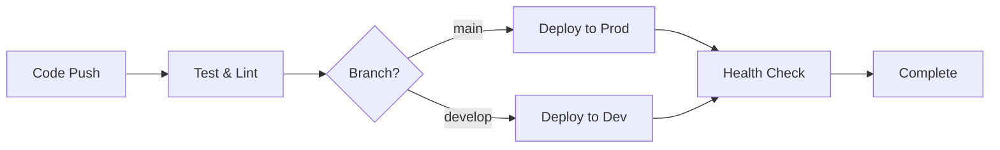

# 🚀 CI/CD 파이프라인 설정 가이드

## 📋 목차
1. [개요](#개요)
2. [사전 준비사항](#사전-준비사항)
3. [AWS IAM 설정](#aws-iam-설정)
4. [GitHub Secrets 설정](#github-secrets-설정)
5. [배포 프로세스](#배포-프로세스)
6. [트러블슈팅](#트러블슈팅)

---

## 개요

이 프로젝트는 GitHub Actions와 AWS CDK를 사용하여 자동 배포 파이프라인을 구축합니다.

### 🏗️ 아키텍처
- **CI/CD**: GitHub Actions
- **인프라**: AWS CDK (Infrastructure as Code)
- **배포 환경**: Production (main 브랜치), Development (develop 브랜치)
- **AWS 리전**: ap-northeast-2 (서울)

### 📦 배포되는 스택
1. **백엔드 스택** (JournalismFaithfulStack)
   - API Gateway
   - Lambda Functions
   - DynamoDB Tables
   - Cognito User Pool

2. **프론트엔드 스택** (JournalismFaithfulFrontendStack)
   - S3 Static Hosting
   - CloudFront Distribution
   - React Application

---

## 사전 준비사항

### 1. AWS 계정 준비
- AWS 계정 생성 및 활성화
- AWS CLI 설치 및 설정
- 충분한 권한을 가진 IAM 사용자

### 2. GitHub 리포지토리
- 코드가 푸시된 GitHub 리포지토리
- main, develop 브랜치 생성

### 3. 로컬 환경
```bash
# AWS CLI 설치 확인
aws --version

# Node.js 18+ 설치 확인
node --version

# Python 3.12+ 설치 확인
python --version

# AWS CDK 설치
npm install -g aws-cdk
cdk --version
```

---

## AWS IAM 설정

### 1. GitHub Actions용 IAM 사용자 생성

#### AWS Console에서:
1. IAM → Users → Add User
2. User name: `github-actions-deployer`
3. Access type: Programmatic access ✅

### 2. 필요한 IAM 정책

다음 정책을 연결하거나 커스텀 정책을 생성:

```json
{
  "Version": "2012-10-17",
  "Statement": [
    {
      "Effect": "Allow",
      "Action": [
        "cloudformation:*",
        "s3:*",
        "lambda:*",
        "apigateway:*",
        "dynamodb:*",
        "cognito-idp:*",
        "cloudfront:*",
        "route53:*",
        "iam:*",
        "logs:*",
        "ssm:GetParameter",
        "bedrock:*"
      ],
      "Resource": "*"
    },
    {
      "Effect": "Allow",
      "Action": [
        "sts:AssumeRole"
      ],
      "Resource": "arn:aws:iam::*:role/cdk-*"
    }
  ]
}
```

### 3. CDK Bootstrap

처음 CDK를 사용하는 AWS 계정/리전에서 실행:

```bash
# AWS 계정 ID 확인
aws sts get-caller-identity --query Account --output text

# CDK Bootstrap 실행
cdk bootstrap aws://YOUR_ACCOUNT_ID/ap-northeast-2
```

---

## GitHub Secrets 설정

### GitHub 리포지토리에서 설정할 Secrets

1. **Settings** → **Secrets and variables** → **Actions**
2. **New repository secret** 클릭
3. 다음 시크릿들을 추가:

| Secret Name | Description | 예시 값 |
|------------|-------------|---------|
| `AWS_ACCESS_KEY_ID` | IAM 사용자 액세스 키 | AKIA... |
| `AWS_SECRET_ACCESS_KEY` | IAM 사용자 시크릿 키 | wJal... |
| `AWS_ACCOUNT_ID` | AWS 계정 ID (12자리) | 123456789012 |

### 선택적 Secrets (CloudFront 사용 시)
| Secret Name | Description |
|------------|-------------|
| `CLOUDFRONT_DISTRIBUTION_ID_PROD` | Production CloudFront ID |
| `CLOUDFRONT_DISTRIBUTION_ID_DEV` | Development CloudFront ID |

---

## 배포 프로세스

### 1. 자동 배포 트리거

배포는 다음 경우에 자동으로 실행됩니다:

- **Production 배포**: `main` 브랜치에 push
- **Development 배포**: `develop` 브랜치에 push
- **수동 실행**: GitHub Actions 탭에서 "Run workflow" 클릭

### 2. 배포 플로우



### 3. 배포 단계별 설명

#### Stage 1: Test & Lint
- Frontend 테스트 실행
- 빌드 검증
- 코드 품질 체크

#### Stage 2: Deploy
- AWS 인증
- CDK 스택 배포
- Frontend 빌드 및 S3 업로드
- CloudFront 캐시 무효화

#### Stage 3: Health Check
- API Gateway 응답 확인
- CloudFront 배포 상태 확인
- 전체 시스템 상태 리포트

---

## 배포 명령어

### 수동 배포 (로컬에서)

```bash
# 1. CDK 디렉토리로 이동
cd cdk

# 2. 의존성 설치
pip install -r requirements.txt

# 3. Frontend 빌드
cd ../frontend
npm ci
npm run build

# 4. CDK 배포
cd ../cdk

# Development 환경
cdk deploy JournalismFaithfulStackDev JournalismFaithfulFrontendStackDev

# Production 환경
cdk deploy JournalismFaithfulStack JournalismFaithfulFrontendStack

# 모든 스택 배포
cdk deploy --all
```

### 스택 상태 확인

```bash
# 스택 목록 보기
cdk list

# 스택 차이점 보기
cdk diff

# CloudFormation 스택 상태
aws cloudformation describe-stacks \
  --stack-name JournalismFaithfulStack \
  --region ap-northeast-2
```

---

## 트러블슈팅

### 문제 1: CDK Bootstrap 오류
```bash
# 해결: Bootstrap 재실행
cdk bootstrap --force
```

### 문제 2: IAM 권한 부족
```bash
# CloudFormation 오류 확인
aws cloudformation describe-stack-events \
  --stack-name JournalismFaithfulStack \
  --region ap-northeast-2
```

### 문제 3: GitHub Actions 실패
- Actions 탭에서 로그 확인
- Secrets 설정 재확인
- 브랜치 보호 규칙 확인

### 문제 4: Frontend 빌드 오류
```bash
# 로컬에서 테스트
cd frontend
CI=false npm run build
```

---

## 모니터링

### CloudWatch 대시보드
- Lambda 함수 로그: CloudWatch Logs
- API Gateway 메트릭: CloudWatch Metrics
- DynamoDB 성능: CloudWatch Insights

### 비용 모니터링
- AWS Cost Explorer에서 일일 비용 확인
- Budget 알림 설정 권장

---

## 보안 권고사항

1. **IAM 최소 권한 원칙**
   - 필요한 최소 권한만 부여
   - 정기적인 권한 검토

2. **Secrets 관리**
   - GitHub Secrets 사용
   - AWS Secrets Manager 활용 검토
   - 절대 코드에 하드코딩 금지

3. **브랜치 보호**
   - main 브랜치 보호 규칙 설정
   - PR 리뷰 필수화

4. **모니터링**
   - CloudWatch 알람 설정
   - 비정상 활동 감지

---

## 추가 리소스

- [AWS CDK Documentation](https://docs.aws.amazon.com/cdk/)
- [GitHub Actions Documentation](https://docs.github.com/actions)
- [AWS Best Practices](https://aws.amazon.com/architecture/well-architected/)

---

## 문의사항

배포 관련 문제가 있으시면 다음 채널로 문의해주세요:
- GitHub Issues
- 개발팀 Slack 채널
- 기술 지원 이메일